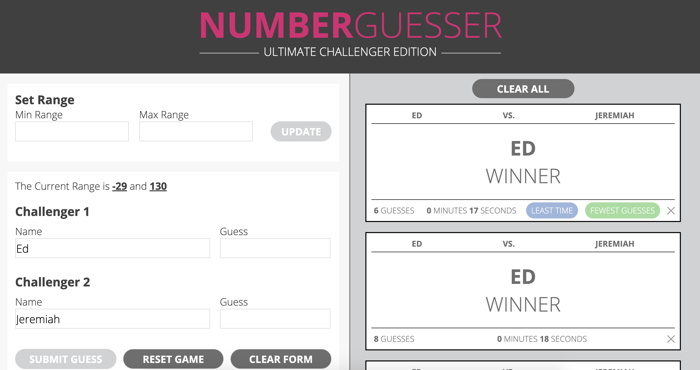
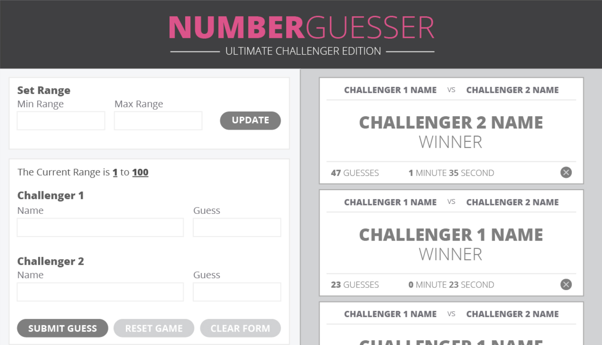
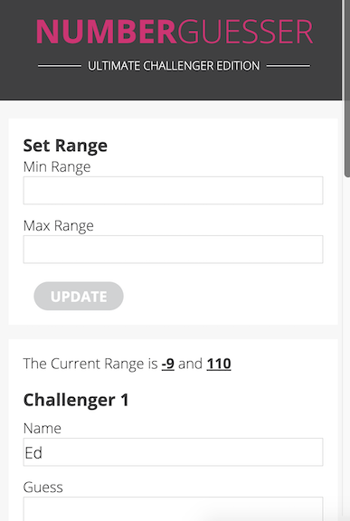
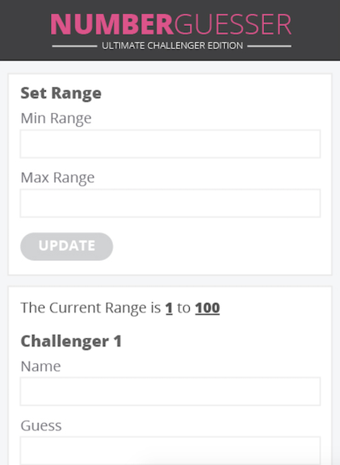

# Number-Guesser

### FE1 Paired-Programming Project

## Purpose:

This project gave us an opportunity to further develop our conceptual and functional understanding of JavaScript, practice and refine our knowledge of CSS and HTML, begin pair-programming, and establish good habits concerning the Git and Github workflow. To accomplish these things, we were tasked with recreating the "Number-Guesser" comp.

Our assignment was to create a number guesser game in which two players try to guess a randomly generated number. Once a player guesses the correct number, a winner card is displayed at right.

We were provided with a visual comp that we needed to match.

Our site:

Comp:

Our site:  

Comp:  

Implemented functionality extensions include:

* A mobile responsive design has been implemented for the layout using media queries.

* When the game is won, the max increases by 10 and the min decreases by 10.

* A visual indicator (a colored badge) is included on the winner card when the round has the least amount of guesses or the least amount of time. If the amount of guesses ties a previous round(s), the previous winners retain the "least guesses" badge(s), while the new winner also gets the badge.

* A "clear all" button appears above the winner cards after the initial winner card appears. All cards, as well as the button, disappear when it is clicked. The "clear all" button reappears when the next winner card appears.

* When a user uses the Konami code, the value in the Challenger 1 Guess input becomes the random number generated.

* The winner cards display the amount of time it took to finish the game. Ternary operators are used to display singular or plural verbiage appropriately.

Other functionalities implemented:

* When both users guess the correct number, the winner shows as "tie."

* The "reset game" button resets the game, clears out all displays, inputs, start time, and guess counter.
